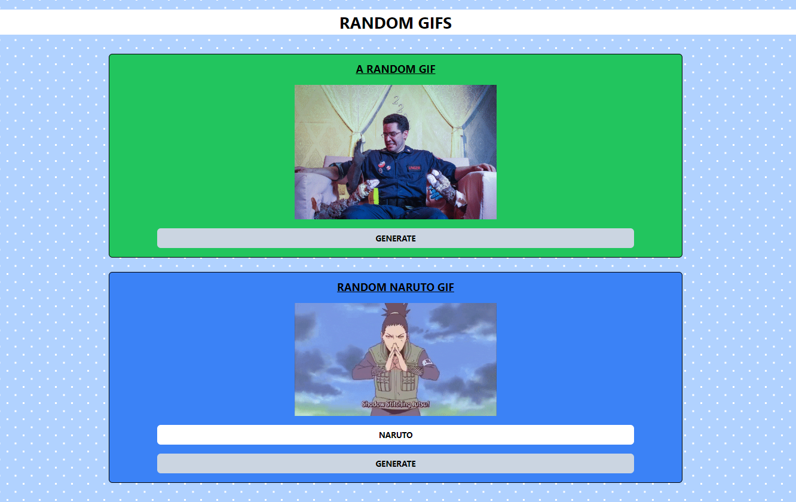

# 🚀 Random Meme Generator App 🤣

Welcome to the Random Meme Generator app! This dynamic React application brings humor to your fingertips, allowing you to generate hilarious memes in two exciting ways. 🎉



## 📋 Features

✨ Here are some exciting features of the Random Meme Generator:

- 🤪 **Random Memes**: Click the "Generate" button, and watch as a new meme appears with every click.
- 🖼️ **Category Selection**: Pick a meme category of your choice, and click "Generate" to get memes from that category.
- 📤 **Share Memes**: Share your favorite memes with friends and family on social media.
- 🔄 **Infinite Fun**: Keep clicking for endless meme entertainment.

## 🚀 Quick Start

Getting started with the Random Meme Generator is a breeze:

1. **Clone the Repository:**

   ```bash
   git clone https://github.com/your-username/random-meme-generator.git
   ```

2. **Navigate to the Project Folder:**

   ```bash
   cd random-meme-generator
   ```

3. **Install Dependencies:**

   ```bash
   npm install
   ```

4. **Start the App:**

   ```bash
   npm start
   ```

5. **Open Your Browser:**

   The app will be running at `http://localhost:3000`.

## 🎨 Customization

Feel free to customize the Random Meme Generator app to match your style and preferences:

- Modify the CSS in the `src/styles` folder to change the app's appearance.
- Add your favorite memes to the meme library by following the data structure in `src/data/memes.js`.

## 🌐 Live Demo

Check out the live demo of the Random Meme Generator here: [Live Demo](https://aasn0119.github.io/React-random_Memes_Generator/)

## 🤝 Contributing

If you have ideas to improve the Random Meme Generator, contributions are welcome! Fork the repository, create a new branch, and submit a pull request.

## 📞 Contact

If you have any questions or want to get in touch, feel free to reach out:

- Email: aasnsa05@gmail.com
- LinkedIn: [@YourLinkedInHandle](https://www.linkedin.com/in/anuj-abhi-s019)

Let the meme-creating fun begin! Happy coding and meme-sharing! 😄🎉
